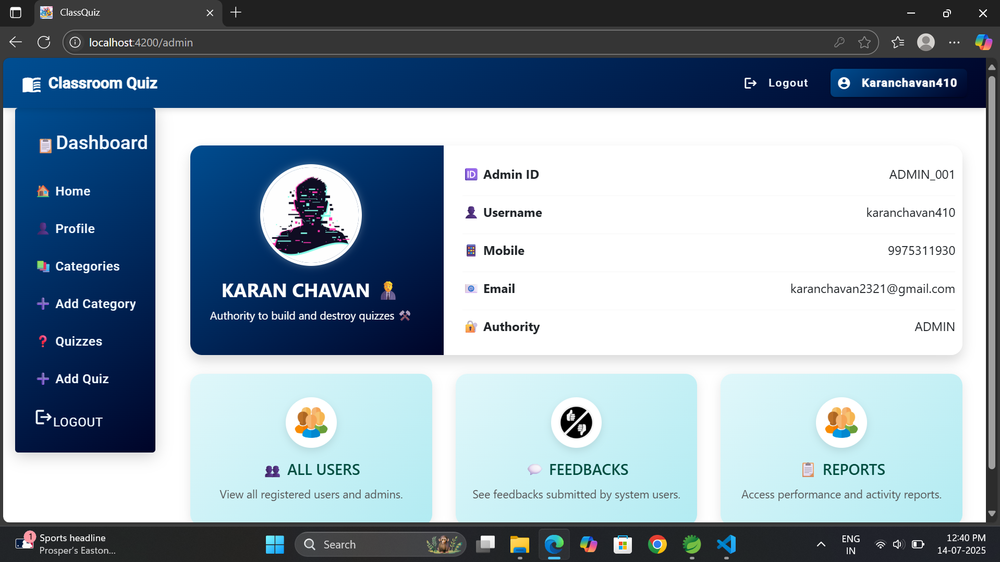
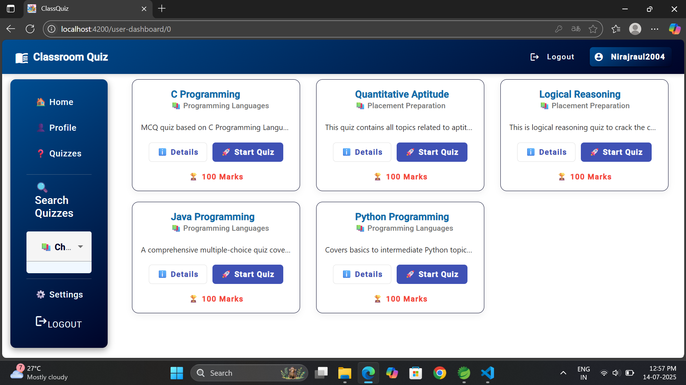

# 🎓 ClassQuizApplication


Welcome to **ClassQuizApplication** – a modern online quiz platform built with **Angular (latest)** for frontend and **Spring Boot (JDK 21)** for backend. This project aims to deliver a clean and efficient environment for conducting quizzes between **Admin(Teacher)** and **Students**. 🧠📘

---

## 📘 Overview

**ClassQuiz** is a full-stack web application that allows students to take quizzes and view their results in real-time, while admins can manage quizzes, users and performance reports.

---

## 👨‍💻 Roles

- 👑 **Admin(Teacher)**  
  - Create, update and delete quizzes  
  - Manage questions and categories  
  - View student results and download reports  
  - Handle feedbacks

- 🎓 **Student**  
  - View & attempt quizzes  
  - View past history  
  - Submit feedback  
  - Download result in PDF

---

## ✨ Features

- 🔐 JWT-Based Authentication & Role-Based Access
- 🧠 Timed Quizzes with Auto Submission
- 🧾 PDF Download of Quiz Results
- 📈 Performance Tracking
- ✍️ Feedback Submission
- 📚 History of Attempted Quizzes
- 🧑 Responsive UI with Angular Material

---

## 🚀 Tech Stack

| Category        | Technologies                                |
|-----------------|---------------------------------------------|
| 🧠 Frontend     | Angular 17+, Angular Material, Bootstrap    |
| 🔧 Backend      | Spring Boot 3.1, Java 21, REST API          |
| 🗃️ Database     | MySQL 8.0                                   |
| 🔐 Security     | Spring Security, JWT Authentication         |
| 📦 Build Tools  | Maven (backend), npm (frontend)             |
| 📄 PDF Handling | jsPDF (for exporting results)               |
| 🌐 Server       | Apache Tomcat (embedded)                    |

---

## 📸 Screenshots

### Home Page


### Login Page


### Register Page


### Admin Login Page


### Admin Dashboard Page


### Admin Profile Page


### Admin All Categories


### Admin Modify Categories


### Admin Add New Category


### Admin Add New Quiz


### Admin All Quizzes


### Admin Show Quiz


### Admin View Quiz Questions


### Admin Add New Question


### Admin Modify Question


### Admin Delete Question


### Admin Update Quiz


### Admin Show Attempted Quiz Records


### Admin Delete Quiz


### Admin All Feedbacks


### User Login Page


### User Profile Page


### User Dashboard Page


### User Start Quiz


### User Quiz Started


### User Submit Quiz


### User Quiz History


### User Quiz Feedback


---

## 🛠️ Setup Instructions

### ⚙️ Prerequisites
- Node.js v16+
- Angular CLI
- Java 17+
- Maven
- MySQL

---

## 🛠️ Project Setup

This project is structured into two main modules:
📁 quizapp → Spring Boot Backend
📁 quizweb → Angular Frontend

### 📦 Clone the Repository

```bash
git clone https://github.com/karanchavan01/ClassQuizApplication.git
cd ClassQuizApplication
